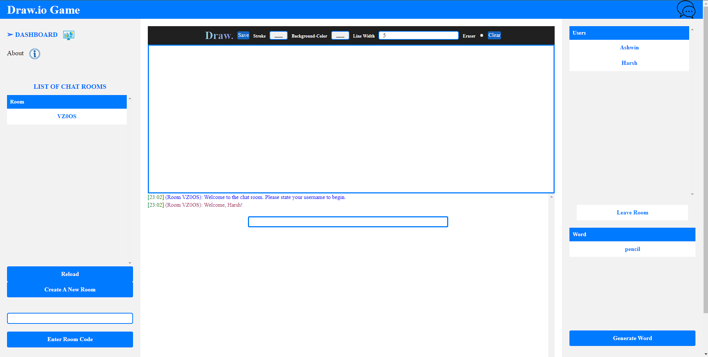
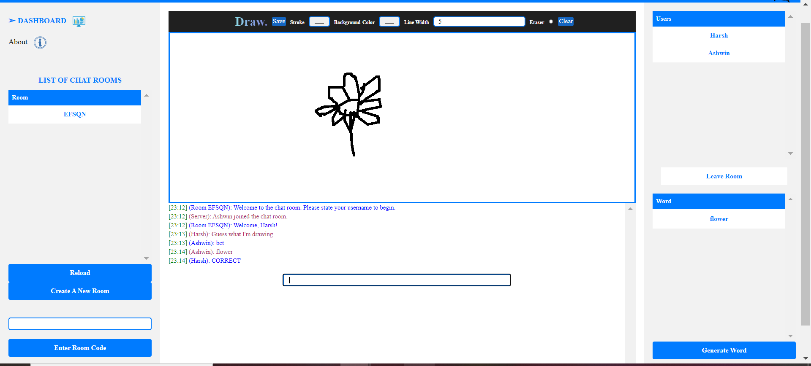
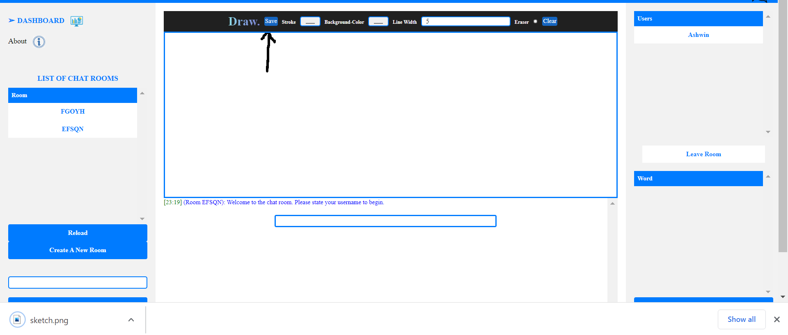
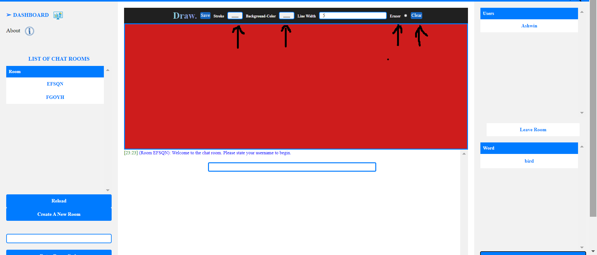

# Course Project - Skribbl.io Game

> Our Team: Zainulabuddin Syed, Ashwin Gnanaseelan, Harsh Patel, Taha Rana

> Course: CSCI 2020U: Software Systems Development and Integration

## Project Information:
This project aims to develop a [skribbl.io](https://skribbl.io/) game with a web chat server using websockets for real-time communication.
The server will support multiple game rooms, where users can create new game rooms and exchange messages and drawings with others only in 
the same room. Users can switch between the game rooms, and upon doing so, they will automatically leave their previous room. Additionally, 
a user needs to join a room to be able to send messages and be able to draw. To start the game the user will click the Generate Word Button 
which will provide them with an object to draw, while the second players objective is to guess the said word. This project will involve 
building a web application using HTML, CSS, and JavaScript to provide a user-friendly interface for interacting with the chat server. 

## Additional Project Information:
The project also doubles as a mutli-socket drawing board, as multiple users can join the same room and draw on the same board. They can draw lines, change the background, and erase the board. Doing so will update the board for all users in the room. Users can have fun drawing with their friends annd communicate with each other and then download and save their images if they are satisfied with them.

The following picture shows the skribbl.io game running:

The following picture shows Player1 Drawing the object Generated and Player2 Guessing the object Drawn:

The following picture allows the User to save their Amazing Drawing:

The following picture allows the User to pick what Stroke or Background Colour they prefer along with the Line Width:


## How to Run (Instructions):
* Git Clone the Repository 
* Open the folder through IntelliJ
* Navigate to Edit configuration and add Glassfish Local
* Go to deployment -> Artifact -> war exploded
* Go back to the server
* Set the server domain to 'domain1'
* Apply the changes and click OK.
* Then go to the top right and run it through the glass fish server
* Wait for it to load and then it will open your default browser with the application running
* NOTE: For you to have multiple players in the game you need to make sure you are running the current file then run the `index.html` file


##  Resources:
#### Project Libraries Used
```
*package com.example.webchatserver;
*import jakarta.websocket.*;
*import jakarta.websocket.server.PathParam;
*import jakarta.websocket.server.ServerEndpoint;
*import org.json.JSONObject;
*import java.io.IOException;
*import java.util.*;

```

